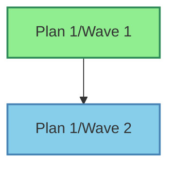

# Phase 4: Stages Agent (Dependency Analysis)

## Overview

Phase 4 of the Foundation Framework acts as the **Stages Agent** that analyzes all plans and waves to create a dependency-aware execution strategy. This phase is critical for enabling parallel execution in Phase 5.

## Purpose

The Stages Agent is responsible for:

1. **Visual Dependency Graph**: Generating Mermaid diagrams for easy visualization
2. **Dependency Analysis**: Analyzing relationships between all plans and waves
3. **Graph Construction**: Building a Directed Acyclic Graph (DAG) of dependencies
4. **Stage Calculation**: Determining which waves can execute in parallel
5. **Critical Path**: Identifying the longest dependency chain
6. **Independent Waves**: Finding waves that can execute anytime
7. **Execution Strategy**: Creating a complete strategy for Phase 5

## Usage

### Basic Usage

```bash
bash .phase4/phase4.sh
```

This will:
- Analyze all plans in the `Plans/` directory
- Extract dependencies from wave subplans
- Build a dependency graph
- Calculate execution stages
- Generate `stages.md` with complete strategy

### Advanced Usage

```bash
# Specify custom directories and files
bash .phase4/phase4.sh \
  --plans-dir phase1_testing/Plans \
  --output execution_strategy.md

# Use specific Cursor model
bash .phase4/phase4.sh -m claude-3-opus

# Adjust retry behavior
bash .phase4/phase4.sh --max-retries 3
```

### Options

| Option | Description | Default |
|--------|-------------|---------|
| `--plans-dir <dir>` | Plans directory to analyze | `Plans` |
| `--output <file>` | Output stages file | `stages.md` |
| `-m, --model <model>` | Cursor model to use | Auto-detect |
| `--max-retries <num>` | Max retries per operation | `2` |
| `-h, --help` | Show help message | - |

## Prerequisites

1. **Phase 1 Complete**: Plans must be generated with wave decomposition
2. **Phase 3 Complete** (recommended): Plans should be optimized
3. **Cursor CLI** (optional): For AI-powered dependency analysis
   - Install: Follow Cursor CLI documentation
   - Authenticate: `cursor-agent login`

## Input

### Required
- `Plans/` directory with plan folders (plan1/, plan2/, etc.)
- Each plan should have `waves/` subdirectories
- Each wave should have `subplan*.md` files

### Analyzed
The Stages Agent analyzes:
- Wave subplan files for dependency keywords
- Cross-plan dependencies
- Sequential dependencies between waves
- Parallel execution opportunities

## Output

### stages.md

The primary output is `stages.md` containing:

#### 1. Mermaid Dependency Graph Visualization
An interactive visual diagram of all dependencies:

````markdown

````

- 🟢 **Green boxes**: Independent waves (no dependencies)
- 🔵 **Blue boxes**: Dependent waves
- **→ Arrows**: "depends on" relationship

This diagram is automatically generated and renders in:
- GitHub/GitLab markdown viewers
- VS Code with Markdown Preview Enhanced
- Obsidian, Notion, and other modern markdown tools

#### 2. Textual Dependency List
```markdown
## Wave Dependencies
- plan1/wave1: No dependencies
- plan1/wave2: Depends on plan1/wave1
- plan2/wave1: No dependencies
```

#### 2. Execution Stages
```markdown
## Stage 1 (Parallel Execution)
- plan1/wave1
- plan2/wave1
- plan3/wave1

## Stage 2 (Parallel Execution)  
- plan1/wave2 (depends on plan1/wave1)
- plan2/wave2 (depends on plan2/wave1)
```

#### 3. Critical Path
The longest dependency chain through the system.

#### 4. Independent Waves
Waves with no dependencies and no dependents.

#### 5. Execution Strategy
Detailed recommendations for Phase 5:
- Recommended execution order
- Parallel execution strategy
- Resource allocation guidance
- Risk mitigation approaches
- Testing strategy
- Rollback procedures

## How It Works

### Step 1: Dependency Extraction
For each wave in each plan:
1. Read the wave's `subplan*.md` file
2. Search for dependency keywords:
   - "depend", "prerequisite", "require"
   - "after", "before"
   - References to other plans/waves
3. Extract and record dependencies

### Step 2: Graph Construction
- Build a Directed Acyclic Graph (DAG)
- Nodes = waves
- Edges = dependencies
- Validate no circular dependencies

### Step 3: Stage Calculation
Using the DAG:
1. **Stage 1**: All waves with no dependencies
2. **Stage 2**: Waves depending only on Stage 1
3. **Stage N**: Waves depending on Stage N-1
4. Continue until all waves assigned

### Step 4: Critical Path Analysis
- Find longest path through the DAG
- Identify bottleneck waves
- Calculate minimum execution time

### Step 5: Independent Wave Detection
- Find waves with no incoming edges (no dependencies)
- Find waves with no outgoing edges (no dependents)
- Mark waves meeting both criteria as independent

### Step 6: Strategy Generation
Generate recommendations for:
- Execution order
- Parallelism opportunities
- Resource allocation
- Risk mitigation
- Testing approach
- Failure handling

## AI-Powered vs. Basic Mode

### AI-Powered Mode (Recommended)
**Requirements**: Cursor CLI installed and authenticated

**Features**:
- Intelligent dependency detection
- Advanced graph analysis
- Critical path optimization
- Detailed execution strategy
- Resource allocation recommendations
- Risk analysis

**Advantages**:
- More accurate dependency detection
- Better parallelism optimization
- Comprehensive strategy
- Smarter resource allocation

### Basic Mode (Fallback)
**When**: Cursor CLI not available or not authenticated

**Features**:
- Keyword-based dependency extraction
- Simple stage grouping
- Basic execution order
- Template-based strategy

**Limitations**:
- May miss implicit dependencies
- Less optimization
- Generic recommendations
- No critical path calculation

## Dependency Detection

The Stages Agent looks for dependencies in several ways:

### 1. Explicit Dependencies
In wave subplan files:
```markdown
## Dependencies
- Wave 1 must be complete
- Requires plan2/wave3
```

### 2. Implicit Dependencies
Keywords in text:
- "after completing wave X"
- "depends on the setup from wave Y"
- "requires the API from plan2"

### 3. Sequential Dependencies
Waves within the same plan typically have sequential dependencies:
- wave2 depends on wave1
- wave3 depends on wave2
- etc.

### 4. Cross-Plan Dependencies
References to other plans:
- "integrates with plan2"
- "uses the database schema from plan1"

## Examples

### Example 1: Basic Analysis
```bash
# Run with defaults
bash .phase4/phase4.sh
```

**Output**:
```
[PHASE 4] ==========================================
[PHASE 4]   Foundation Framework - Phase 4
[PHASE 4]   Stages Agent (Dependency Analysis)
[PHASE 4] ==========================================

[INFO] Plans Directory: /Users/you/project/Plans
[INFO] Output File: /Users/you/project/stages.md
[SUCCESS] Found 3 plan(s)

[PHASE 4] Analyzing dependencies across all plans and waves...
[INFO] Analyzing plan1...
[INFO] Analyzing plan2...
[INFO] Analyzing plan3...
[SUCCESS] Dependency analysis complete

[PHASE 4] Building dependency graph with AI analysis...
[SUCCESS] AI dependency graph generated

[PHASE 4] Generating execution strategy...
[SUCCESS] Execution strategy generated

[PHASE 4] Writing stages.md...
[SUCCESS] Written: /Users/you/project/stages.md

[SUCCESS] ==========================================
[SUCCESS] Phase 4 Complete!
[SUCCESS] ==========================================
[INFO] Dependency graph: /Users/you/project/stages.md
[INFO] 
[INFO] Next Step: Review stages.md and run Phase 5
[INFO]   bash .phase5/phase5.sh --stages stages.md
```

### Example 2: Custom Configuration
```bash
# Use specific model and paths
bash .phase4/phase4.sh \
  --plans-dir phase1_testing/Plans \
  --output strategy.md \
  -m claude-3-opus
```

### Example 3: Preview Plans
```bash
# See what will be analyzed
find Plans -name "subplan*.md" -type f
```

## Troubleshooting

### Issue: "Plans directory not found"
**Solution**: Run Phase 1 first:
```bash
bash .phase1/phase1.sh plan.md
```

### Issue: "No plans found"
**Solution**: Ensure Phase 1 completed successfully:
```bash
ls -la Plans/
```

### Issue: "Cursor CLI not authenticated"
**Solution**: Authenticate Cursor CLI:
```bash
cursor-agent login
```
Or continue with basic mode (still functional).

### Issue: Dependencies seem incorrect
**Possible causes**:
1. Wave subplans lack explicit dependency statements
2. Dependency keywords not recognized
3. Implicit dependencies not detected

**Solutions**:
- Add explicit dependency sections to subplans
- Use standard keywords: "depends", "requires", "after"
- Review and manually edit `stages.md` if needed

### Issue: Too many parallel stages
**Solution**: This may indicate:
- Missing dependencies in subplans
- Overly aggressive parallelization
- Review `stages.md` and add dependencies if needed

### Issue: No parallelism opportunities
**Solution**: This may indicate:
- All waves have sequential dependencies
- Overly conservative dependency detection
- Consider if some dependencies are truly required

## Integration with Other Phases

### Input from Phase 3
- Optimized plans with clear objectives
- Enhanced wave subplans with details
- Decision logs with rationale

### Output to Phase 5
- `stages.md` with execution strategy
- Dependency graph for coordination
- Parallel execution opportunities
- Resource allocation guidance

## stages.md Format

The generated `stages.md` follows this structure:

```markdown
---
Generated by Foundation Framework Phase 4
Date: 2024-10-31 12:00:00
Stages Agent: Dependency Analysis & Execution Strategy
---

# Execution Stages

## Dependency Graph

### Wave Dependencies
[List of all waves and their dependencies]

### Execution Stages

#### Stage 1 (Parallel Execution)
[Waves with no dependencies]

#### Stage 2 (Parallel Execution)
[Waves depending on Stage 1]

#### Stage N (Parallel Execution)
[Final waves]

### Independent Waves
[Waves that can run anytime]

### Critical Path
[Longest dependency chain]

### Parallelism Opportunities
[Analysis of parallel execution potential]

---

## Execution Strategy

### Recommended Execution Order
[Step-by-step guide]

### Parallel Execution Strategy
[How to maximize parallelism]

### Resource Allocation
[Agent/worker recommendations]

### Risk Mitigation
[What to watch for]

### Testing Strategy
[When to run tests]

### Rollback Strategy
[Failure handling]

---

## How to Use This Document
[Guidance for Phase 5]

## Next Steps
[What to do next]
```

## Best Practices

1. **Run Phase 3 First**: Optimized plans have better dependency information
2. **Explicit Dependencies**: Add clear dependency sections to wave subplans
3. **Review stages.md**: Manually verify the dependency graph makes sense
4. **Update as Needed**: You can manually edit `stages.md` before Phase 5
5. **Use AI Mode**: Authenticate Cursor CLI for best analysis
6. **Validate Graph**: Check for missing or incorrect dependencies

## Performance

- **Typical Runtime**: 2-5 minutes (with AI)
- **Basic Mode**: 30-60 seconds
- **Large Projects**: Up to 10 minutes
- **Dependency Extraction**: Scales linearly with wave count

## Validation

After Phase 4, validate:

1. **Dependency Graph**: Do dependencies make sense?
2. **Stages**: Are parallel stages truly independent?
3. **Critical Path**: Is this the longest path?
4. **Resource Needs**: Can you allocate recommended resources?
5. **Execution Order**: Does it follow logical implementation order?

## Next Steps

After Phase 4 completes:

1. **Review stages.md**: Understand the execution strategy
2. **Validate Dependencies**: Ensure graph is correct
3. **Plan Resources**: Allocate agents for parallel execution
4. **Proceed to Phase 5**: Begin parallel execution
   ```bash
   bash .phase5/phase5.sh --stages stages.md
   ```

## Constitutional Reference

This phase implements **Article II, Section 3, Subsubsection: Phase 4** of the Foundation Constitution:

> **Phase 4: Stages Agent**
> 
> The Stages Agent analyzes all optimized plans and waves to identify dependencies, build a dependency graph (DAG), calculate execution stages enabling parallel execution, identify the critical path, mark independent waves, and generate stages.md with the complete execution strategy.

## Support

For issues or questions:
1. Check dependency extraction in wave subplans
2. Review `stages.md` for accuracy
3. Try re-running with AI mode
4. Manually edit `stages.md` if needed
5. Consult Foundation Constitution
6. Check Cursor CLI status: `cursor-agent status`

## Advanced: Manual stages.md Editing

You can manually edit `stages.md` before Phase 5 if:
- Dependencies are incorrect
- You want different stage groupings
- You need to adjust parallel execution
- Resource constraints require changes

Just maintain the markdown structure for Phase 5 compatibility.

---

*Part of the Foundation Framework - Constitutional Programming System*
*Version: 1.0*
*Last Updated: October 31, 2024*

