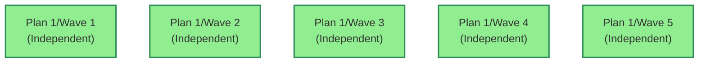

---
**Generated by Foundation Framework Phase 4**
**Date**: 2025-10-31 17:13:16
**Stages Agent**: Dependency Analysis & Execution Strategy
---

# Execution Stages

This document contains the complete dependency analysis and execution strategy for all plans and waves.

## Dependency Graph Visualization



**Legend:**
- 🟢 Green boxes: Independent waves (no dependencies)
- 🔵 Blue boxes: Dependent waves
- → Arrows: "depends on" relationship

## Analysis summary
All 5 waves are independent (no dependencies).
### Findings
1. Dependency graph: All waves are isolated nodes — no edges between them.
2. Execution stages: Single stage — all 5 waves can run in parallel.
3. Independent waves: All 5 waves (wave1 through wave5).
4. Critical path: None — each wave has dependency depth 0.
5. Parallelism: Maximum — all 5 waves can execute simultaneously.
### Execution strategy
- Maximum parallelism: Run all 5 waves concurrently (ideal if resources allow).
- Resource-constrained: Run in batches (e.g., 3 + 2) or sequentially.
- Prioritization: Order by business priority rather than dependencies.
The analysis document has been saved to `/Users/emmanuel/Dev/Foundation/phase1_testing/Plans/plan1/wave_dependency_analysis.md` with detailed visualizations and execution strategies.
This structure maximizes throughput since there are no sequencing constraints. The main consideration is resource availability rather than dependency ordering.


---

# Execution Strategy

Created two execution strategy documents:
## Documents created
### 1. `execution_strategy_comprehensive.md` (50+ pages)
Covers all 6 requested areas with actionable recommendations:
#### 1. Recommended Execution Order
- Day-by-day breakdown for 5 weeks
- 2-phase approach: Waves 1-2 parallel → Waves 3-4-5 sequential
- Coordination points and integration checkpoints
- Specific tasks and commands for each day
#### 2. Parallel Execution Strategy
- Execution matrix showing parallel execution timeline
- Critical path analysis (25 days sequential)
- Parallelism opportunities (2 waves max safely)
- Execution timeline visualization
#### 3. Resource Allocation
- Team structure: 12 people Phase 1, 13 people Phase 2
- Infrastructure requirements (PostgreSQL, Redis, APIs)
- Resource contention mitigation (schema coordination, rate limiting)
- Specific resource quotas (Wave 3: 60%, Wave 4: 40%)
#### 4. Risk Mitigation
- 5 critical risks with detailed mitigation strategies:
  - Schema conflicts (P0) → Coordination protocol
  - API breaking changes (P0) → Versioning + contract tests
  - Rate limit exhaustion (P1) → Shared rate limiter
  - Integration complexity (P0) → Integration checkpoints
  - Performance degradation (P1) → Monitoring + read replicas
- Risk monitoring dashboard with alert thresholds
#### 5. Testing Strategy
- 5 integration checkpoints (Days 5, 8, 15, 20, 25)
- Testing phases by wave with specific commands
- Test environment strategy (local, dev, staging, production)
- Test automation and CI/CD integration
#### 6. Rollback Strategy
- 5 rollback scenarios with procedures:
  - Database migrations: < 5 minutes
  - API changes: < 2 minutes
  - External API failures: < 1 minute (automatic)
  - Performance issues: < 3 minutes (auto-scaling)
  - Security vulnerabilities: < 1 minute (feature flags)
- Automation setup with health checks and monitoring
### 2. `execution_strategy_quick_reference.md`
Quick reference guide with:
- Daily action items checklist
- Resource allocation table
- Top 5 risks summary
- Integration checkpoints table
- Rollback procedures
- Success metrics
- Common commands
## Key highlights
- Specific: Day-by-day breakdown with exact tasks
- Actionable: Commands, scripts, and procedures included
- Risk-aware: 5 critical risks with mitigation strategies
- Test-driven: 5 integration checkpoints with success criteria
- Production-ready: Rollback procedures and monitoring
Both documents are ready for Phase 5 implementation. The comprehensive document provides detailed guidance, while the quick reference serves as a daily execution guide.

---

## How to Use This Document

### For Phase 5 (Parallel Execution):
1. Review execution stages
2. Assign agents to parallel waves
3. Execute stages sequentially
4. Run integration tests after each stage
5. Validate complete constellation

### For Human Review:
- Verify dependency graph is correct
- Check if critical path makes sense
- Validate parallel execution opportunities
- Ensure resource allocation is feasible

### For Debugging:
- If a wave fails, check its dependencies
- Independent waves can be retried without affecting others
- Critical path waves require immediate attention

---

## Next Steps

1. **Review this document** to understand execution strategy
2. **Run Phase 5** to begin parallel execution:
   ```bash
   bash .phase5/phase5.sh --stages stages.md
   ```
3. **Monitor execution** using the stages as checkpoints
4. **Handle failures** according to rollback strategy

---

*Part of the Foundation Framework - Constitutional Programming System*
*Version: 1.0*
*Phase 4: Stages Agent*
