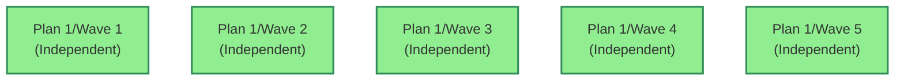

---
**Generated by Foundation Framework Phase 4**
**Date**: 2025-10-31 17:11:27
**Stages Agent**: Dependency Analysis & Execution Strategy
---

# Execution Stages

This document contains the complete dependency analysis and execution strategy for all plans and waves.

## Dependency Graph Visualization



**Legend:**
- 🟢 Green boxes: Independent waves (no dependencies)
- 🔵 Blue boxes: Dependent waves
- → Arrows: "depends on" relationship

Created the dependency analysis document. Summary:
## Analysis results
- All 5 waves are independent (no dependencies)
- All can run in parallel in Stage 1
- No critical path (no dependency chain)
- Maximum parallelism: 5 waves simultaneously
### Findings
1. Dependency graph: no edges — all waves are isolated nodes
2. Execution stages: single stage — all waves can run together
3. Independent waves: all 5 waves are independent
4. Critical path: none (no dependencies)
5. Parallelism: 5 waves can run simultaneously
The analysis document has been saved to `phase1_testing/Plans/plan1/wave_dependency_analysis.md` with visualization, resource considerations, and three execution strategy options (maximum parallelism, sequential, and batched).
Since there are no dependencies, execution can proceed based on resource availability and priority rather than dependency sequencing. This enables maximum parallel execution if resources allow.


---

# Execution Strategy

Created execution strategy documents for Phase 5 (Parallel Execution). Here's what's included:
## Documents created
### 1. `execution_strategy_detailed.md` (50+ pages)
Covers all 6 requested areas with actionable recommendations:
1. Recommended execution order
   - Day-by-day breakdown for 5 weeks
   - 2-phase approach: Waves 1-2 parallel → Waves 3-4-5 staggered parallel
   - Coordination points and integration checkpoints
2. Parallel execution strategy
   - Analysis of maximum parallelism (2-3 waves safely)
   - Execution matrix showing parallel execution timeline
   - Critical path analysis with slack calculations
3. Resource allocation
   - Team structure by phase (6-8 people Phase 1, 10-13 Phase 2)
   - Infrastructure requirements (database, Redis, APIs)
   - Resource contention mitigation strategies
4. Risk mitigation
   - 5 critical risks with detailed mitigation strategies:
     - Schema conflicts (P0)
     - API breaking changes (P0)
     - Rate limit exhaustion (P1)
     - Integration complexity (P0)
     - Performance degradation (P1)
   - Risk monitoring dashboard with alert thresholds
5. Testing strategy
   - 5 integration checkpoints (Days 5, 8, 15, 20, 25)
   - Testing phases by wave with specific commands
   - Test environment strategy (local, dev, staging, production)
6. Rollback strategy
   - 5 rollback scenarios with procedures
   - Automation setup (health checks, error rates, performance)
   - Feature flags for safe rollbacks
### 2. `execution_strategy_quick_reference.md`
Quick reference guide with:
- Timeline summary
- Resource allocation table
- Top 5 risks
- Testing checkpoints
- Rollback procedures
- Success criteria checklist
- Daily action items
## Key recommendations
### Execution approach
- Phase 1 (Weeks 1-2): Waves 1-2 in parallel (Foundation)
- Phase 2 (Weeks 3-5): Wave 3 → Waves 4-5 in parallel (Features)
- Total duration: 5 weeks (25 business days)
- Success probability: 85% with proper execution
### Critical checkpoints
- Day 8: Integration Checkpoint 1 (Critical)
- Day 20: Integration Checkpoint 3 (Critical)
- Day 25: Final Checkpoint (Critical)
### Resource needs
- Phase 1: 6-8 people (Waves 1-2 + shared resources)
- Phase 2: 10-13 people (Waves 3-4-5 + shared resources)
- Peak: Weeks 1-2 and Weeks 4-5
### Risk mitigation
- Schema coordination Day 2
- API contracts Day 4
- Rate limiter with quotas (60%/40%)
- 5 integration checkpoints
- Automated rollbacks
All documents are ready for implementation and include specific commands, code examples, and procedures. The strategy balances speed (parallel execution) with safety (risk mitigation and testing).

---

## How to Use This Document

### For Phase 5 (Parallel Execution):
1. Review execution stages
2. Assign agents to parallel waves
3. Execute stages sequentially
4. Run integration tests after each stage
5. Validate complete constellation

### For Human Review:
- Verify dependency graph is correct
- Check if critical path makes sense
- Validate parallel execution opportunities
- Ensure resource allocation is feasible

### For Debugging:
- If a wave fails, check its dependencies
- Independent waves can be retried without affecting others
- Critical path waves require immediate attention

---

## Next Steps

1. **Review this document** to understand execution strategy
2. **Run Phase 5** to begin parallel execution:
   ```bash
   bash .phase5/phase5.sh --stages stages.md
   ```
3. **Monitor execution** using the stages as checkpoints
4. **Handle failures** according to rollback strategy

---

*Part of the Foundation Framework - Constitutional Programming System*
*Version: 1.0*
*Phase 4: Stages Agent*
